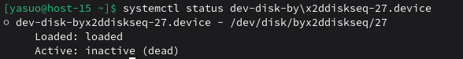
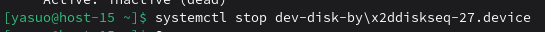
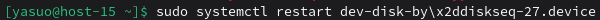
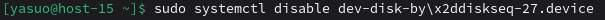
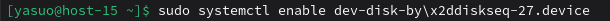

## 1. Что такое systemd юнит?
Systemd запускает и контролирует все системные службы. В ее основе лежит понятие  units, которые связаны между собой и имеют определенное имя и тип с соответствующими конфигурационными файлами, т. е. это файлы конфигурации хранящие информацию о сервисе, сокете, устройстве и т. д.

## 2. Проверье статус любого systemd юнита, какую информацию выводит эта кманда?

Состояние юнита (загружен, активен, работает)
Loaded: loaded - юнит загружен
Active: active (running) - активен и работает
Active: inactive (dead) - неактивен
Описание юнита - краткое описание службы
PID процесса - идентификатор основного процесса
Путь к исполняемому файлу
Время работы - сколько времени работает служба
Последние логи (обычно последние 10 строк)
Показывает сообщения журнала, связанные с юнитом
Ошибки, предупреждения, информационные сообщения
Дополнительная информация:
Процессы, принадлежащие юниту
Состояние контрольной группы (cgroup)
Зависимости и связанные юниты
## 3. ПОпробуйте оставновить сервис.

## 4. Перезапустите его.

## 5. УДалите из автозагрузки

## 6. Верните обратно

## 7. Что такое таймеры?
Таймеры (timers) в systemd - это аналог cron-заданий, но реализованный как systemd юниты. Они позволяют запускать службы или скрипты по расписанию.