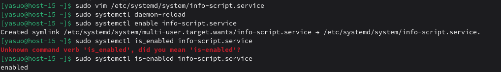
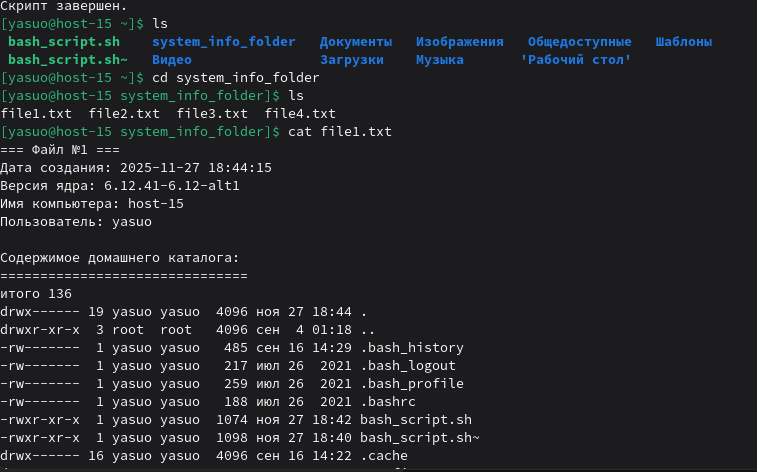
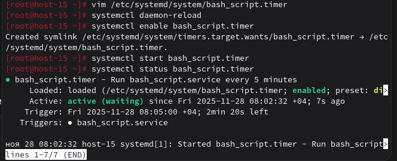
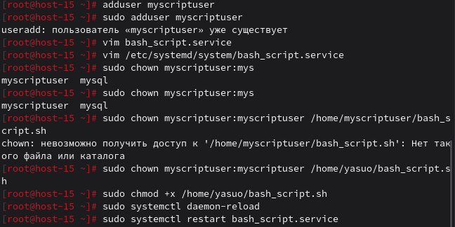
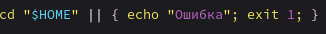

## 1. Создайте скрипт который создаёт папку заполняет её файлами ( имена 1-4 ) и записывает в них информацию о текущей дате, версии ядра, имени компьютера и списе всех файлов в домашнем каталоге пользователя от которого выполняется скрипт( не забудьте сдлеать проверку на существование файлов и папок)
bash_script.sh

## 2. Создайте юнит который будет вызывать этот скрипт при запуске. Проверьте

## 3. Создайте таймер который будет вызывать выполнение одноимённого systemd юнита каждые 5 минут.

## 4. От какого пользователя вызыаются юниты поумолчанию?
Все зависит от типа юнита, который используем. Системные юниты работают по умолчанию от root, если в файле не указана директива User=..., а пользовательские юниты работают от твоего пользователя.
## 5. Создайте пользователя от имени которого будет выполняться ваш скрипт.

## 6. Дополните юнит информацией о пользователе от которого должен выплняться скрипт.
Дополнил выше.
## 7. Дополните ваш скрипт так, что бы он независимо от местоположения всега выполнялся в домашней папке того кто его вызывает.
