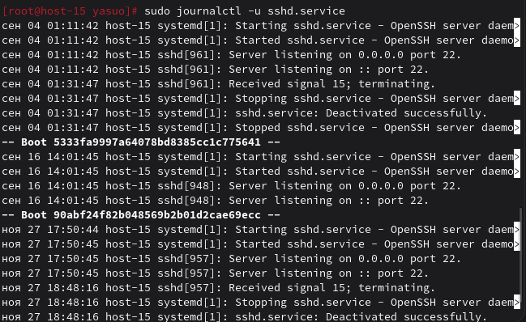
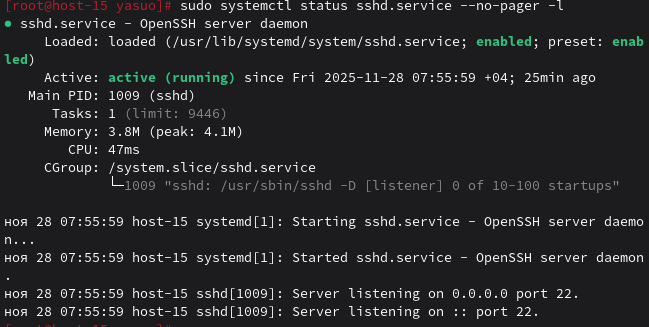
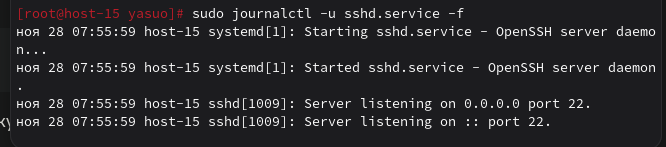

## 1. Посмотретите журналы ssh

## 2. Выведите журналы в реальном времени

## 3. Выведите лог в реальном времени для службы sshd

## 4. Можно ли без комады journalctl прочитать логи systemd?
Просмотр логов systemd без использования команды journalctl затруднён, потому что systemd journald хранит логи в бинарном формате, а не в обычных текстовых файлах.
## 5. Сколько будет 2-2?
false
