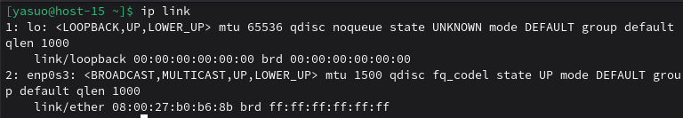
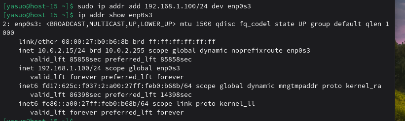
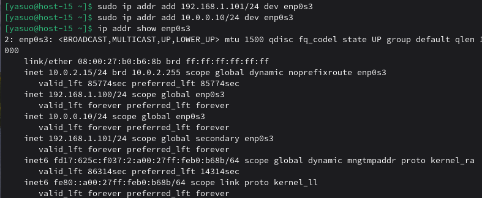
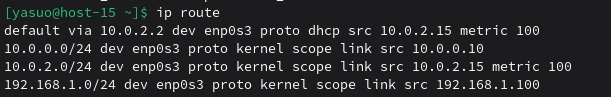
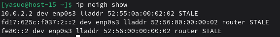

## 1. Выведите список интерфейсов, какими способами можно это сделать?

## 2. Попробуйте изменить ip адрес

## 3. Попробуте добавить несколько ip адресов на сетевую карту

## 4. Выведите список маршрутов

## 5. Выведите arp таблицу

## 6. Что такое ip адрес?
IP-адрес - это уникальный числовой идентификатор устройства в компьютерной сети, работающей по протоколу IP.
## 7. Для чего нужны маршруты?
Маршруты (таблица маршрутизации) - это набор правил, которые определяют, куда должны направляться сетевые пакеты. Это своего рода "дорожная карта" для сетевого трафика.
## 8. Что за протокол arp?
ARP - это протокол разрешения адресов, который связывает IP-адреса с физическими MAC-адресами в локальной сети.
## 9. Что такое dhcp?
DHCP (Dynamic Host Configuration Protocol) - это протокол динамической настройки узлов, который автоматически назначает IP-адреса и другие сетевые параметры устройствам в сети.
## 10. Что такое dns?
DNS (Domain Name System) - это система доменных имён, которая преобразует человеко-читаемые имена сайтов в машинно-читаемые IP-адреса.
## 11. Как называется один из протоколов синхронизации времени?
NTP (Network Time Protocol)
## 12. Что такое широковещательный запрос, зачем он нужен?
Широковещательный запрос - это отправка сетевого пакета всем устройствам в локальной сети одновременно.
## 13. Какой адресс является широковещательным?
Последний адрес в подсети.
## 14. Какие ещё параметры можно задать сетевой карте?
IP-настройки, IPv6 настройки, MTU, MAC-адрес, состояние интерфейса.
## 15. Что такое маска подсети? зачем она нужна?
Маска подсети - это 32-битное число, которое определяет, какая часть IP-адреса относится к сети, а какая - к узлу в этой сети.