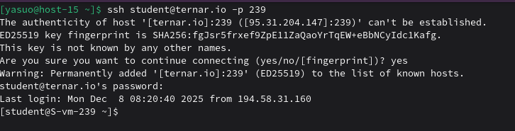
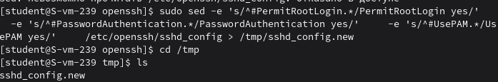
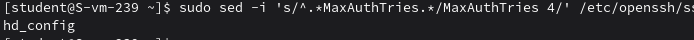
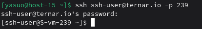
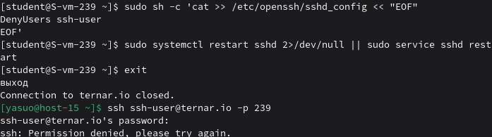

## 1. Какой по умолчанию используется порт для поключения?
22
## 2. Можно ли его изменить? если да то как?
Да, его можно изменить. На сервере можно отредактировать файл конфигурации SSH сервера.
## 3. Какая служба отвечает за обработку запросов на подключения по ssh?
sshd (SSH-Daemon)
## 4. Какой файл конфигурации отвечает за его настройку?
/etc/ssh/sshd_config
## 5. Попробуйте подключиться по ssh к предоставленному вам серверу
## 6. Отредактируйте файл настроек на сервере так, чтобы была возможность подключиться к серверу используя пользователя root

## 7. Измените колличество ошибок ввода пароля перед сборосом соединения, покажите эти измененения

8. Создайте пользователя ssh-user и попробуйте им подключиться к серверу

## 9. Ограничте ему возможность подключения к серверу

## 10. Как вы это сделали?
Добавил в файлик конфигурации строчку DenyUser ssh-user
11. Что хранится в файле known_hosts?
В нем хранятся публичные ключи серверов, к которым я раньше подключался.