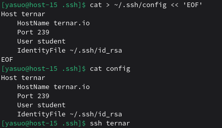
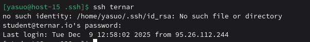

## 1. Где хранятся пользвательские и системные настройки подключения?
Пользовательские хранятся в ~/.ssh/config, а системные в /etc/ssh/ssh_config или /etc/openssh/ssh_config
## 2. Что за файл options?
В контексте SSH, файл options (точнее, он обычно называется config) - это конфигурационный файл клиента SSH, который содержит настройки для подключения к различным хостам.
## 3. Отредактируйте файл options так, чтобы можно было подключаться не вводя имя пользвателя и порт

## 4. Назовите подключение удобным для вас спсобом
Назвал ternar
## 5. Проверьте работоспособность
