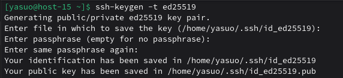
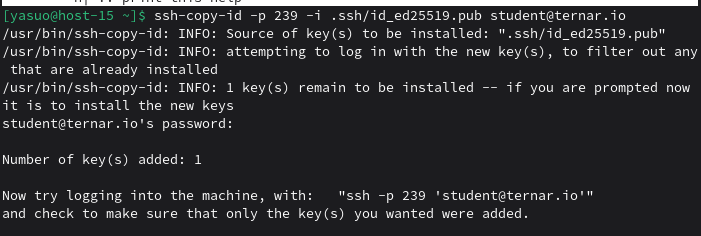
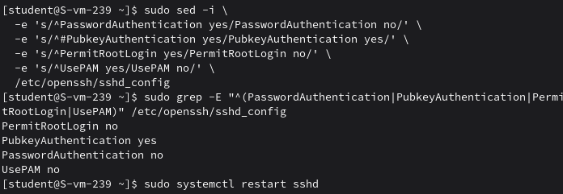

## 1. Что такое ssh ключи и зачем они нужны?
SSH ключи - это пара криптографических ключей (приватный и публичный), используемых для безопасного входа на удалённые серверы или системы вместо пароля.
## 2. Как их создать? 
ssh-keygen
## 3. Создайт пару публичный/приватный ключ ed_25519, где они хранятся?

Приватный ключ: ~/.ssh/id_ed25519
Публичный ключ: ~/.ssh/id_ed25519.pub
## 4. Скопируйте публичный ключ на ваш сервер, в каком файле он будет храниться?

На сервере ключ хранится в файле:
~/.ssh/authorized_keys
## 5. Попробуйте подключиться к серверу, у вас запросили пароль?
Нет, но запросили passphrase, который я задавал при создании ключа.
## 6. Запретите подключение с паролем для всех пользователей, оставьте только с помощью ключа.
