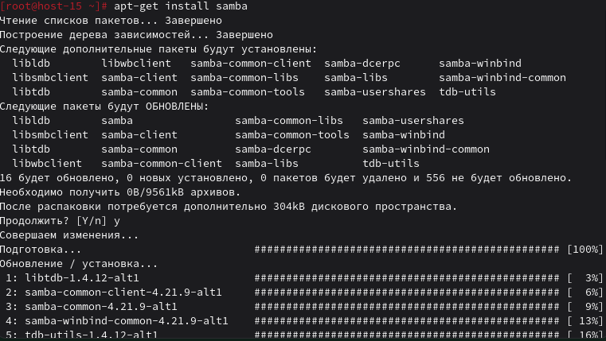
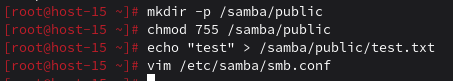
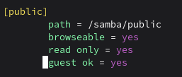
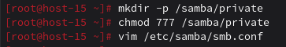
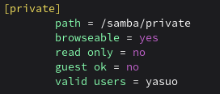
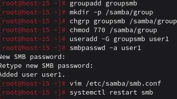
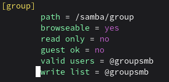
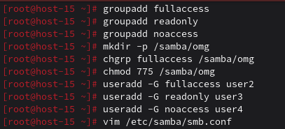
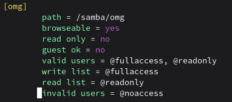

## 1. Установите пакет samba

## 2. ЧТо такое побщая папка, зачем оно может быть нужно?
Общая папка - это ресурс Samba для обмена файлами по сети между Linux и Windows. Нужна для совместного доступа к файлам в локальной сети.
## 3. Создайте общую папку без пароля с правами только на чтение файлов

## 4. Создайте общую папку с паролем с правами на чтение и запись

## 5. Создайте общую папку с доступом для какой-то группы с полными правами

## 6. Создайте общую папку в которой у одной группы будет полный доступ, а у другой только доступ на чтение. Третья группа не должна иметь к ней доступа

