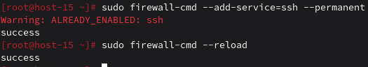
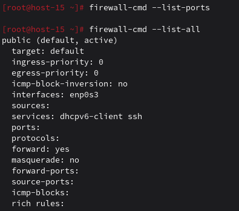
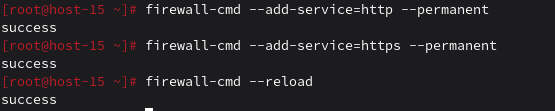
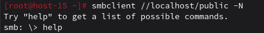
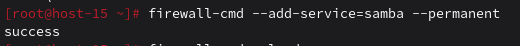

# Открываем firewald

## 1. Удалите iptables и установите firewalld
```
apt-get remove iptables 
apt-get install firewalld
systemctl enable firewalld
systemctl start firewalld
```
## 2. Попробуйте так-же проверить возможность подключения по ssh
```ssh student@ternar.io -p 239```
## 3. Если её нет то откройте порт

## 4. Выведите список открытых портов с помощью firewall-cmd

## 5. Можно ли там добавить порты по названию сервиса?
Да, можно.

## 6. На вашей Локальной виртуальной машине попробуйте подключиться к серверу samba из предыдущих заданий

## 7. Если не получилось то откройте нужные порты
Получилось, но если бы не получилось, то открывал бы порты также, как делал это выше.
## 9. Сделайте так чтобы изменения были постоянными
